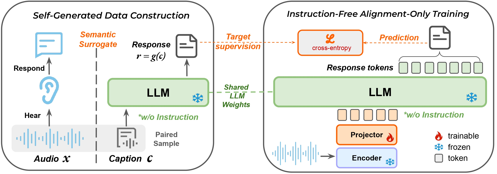

# Alignment Is All You Need: Instruction-Free Training for General Audio-Language Models

<p align="center">
  
</p>


We ask a simple question: **is alignment alone sufficient to build a competitive LALM?** By keeping both the audio encoder and the LLM **fully frozen** and training only a lightweight projector on `(audio, response)` pairs generated via **Self-Generated Data Construction**, our LALM matches or surpasses heavily post-trained baselines on mainstream benchmarks using substantially less data.

This repository provides the full training pipeline, built on the standard HuggingFace `from_pretrained` / `save_pretrained` interface throughout.

---

## Overview

**Pipeline:**&nbsp; Audio &nbsp;→&nbsp; `Encoder` *(frozen)* &nbsp;→&nbsp; `Projector` *(trainable)* &nbsp;→&nbsp; `LLM` *(frozen)* &nbsp;→&nbsp; Text

Two ingredients:

1. **Self-Generated Data Construction.** Treat a caption `c` as a *semantic surrogate* for the audio `x`; feed `c` to a frozen LLM with no instruction to obtain a free-form response `r = g(c)`. The pair `(x, r)` is the training target.
2. **Instruction-Free Alignment-Only Training.** The *same* frozen LLM consumes the audio prefix from `Encoder → Projector`, supervised by `r` under causal cross-entropy. Only the projector receives gradients — training reduces to aligning audio representations to the LLM's own caption-conditioned response distribution, no external annotation required.

---

## Self-Generated Data Construction

Given a caption source (open-source paired text or a captioner such as Qwen3-Omni-Captioner), we use a frozen LLM to expand each caption into a free-form response — no instructions, no task templates.

Edit the config block at the top of `utils/run.sh` (model path, input file, output dir), then:

```bash
cd utils
bash run.sh     # start
bash stop.sh    # stop
```

**Input**: a `.scp` file where each line is a JSON record:
```
{"idx": ..., "caption": ...}
```

**Output**: one `.json` file per clip in `OUT_DIR/`, with the original `caption` field preserved and a generated response attached.

Key parameters in `run.sh`:

| Parameter | Description | Recommendation |
|---|---|---|
| `NUM_WORKERS` | CPU worker processes | `CPU cores × 2–3` |
| `QUEUE_MAX` | Shared queue size | `MAX_SEQS × 256–512` |
| `MAX_SEQS` | Max concurrent GPU sequences | 8 (40GB), 16 (80GB) |

---

## Instruction-Free Alignment-Only Training

Install Audio & Multimodal Understanding Research Toolbox: [Auden](https://github.com/AudenAI/Auden):
```bash
git clone https://github.com/AudenAI/Auden.git
cd Auden
pip install -e .
```

The audio encoder and the LLM stay fully frozen throughout. Only the projector is trained.

```bash
cd lalm
```

### Step 1 — Build Model

Assemble a LALM checkpoint from a pretrained LLM and audio encoder. This is a one-time step that produces a self-contained HF checkpoint.

```bash
bash scripts/build_model.sh
```

Key options in `scripts/build_model.sh`:

| Variable | Description |
|---|---|
| `llm` | Path to pretrained LLM (e.g. Qwen2.5-7B-Instruct) |
| `encoder` | Path to audio encoder (e.g. Whisper-large-v2, Qwen3-Omni AuT, Qwen2.5-Omni) |
| `projector_downsample_rate` | Frame concat rate in the projector (higher → fewer audio tokens; we use 2–8 to land at 6.25–12.5 Hz) |
| `output_dir` | Where to save the assembled checkpoint |

The assembled checkpoint can be loaded like any HF model:

```python
from lalm_core.model import LALMForConditionalGeneration, LALMProcessor

model = LALMForConditionalGeneration.from_pretrained(output_dir)
processor = LALMProcessor.from_pretrained(output_dir)
```

---

### Step 2 — Prepare Manifest

Each training/evaluation sample needs a `conversation` field attached to its Lhotse cut.

For Instruction-Free Alignment-Only training data:

```bash
bash scripts/prepare_manifest.sh
```

For evaluation on QA benchmarks:

```bash
python prepare_conversation_qa.py \
    --input_manifest /path/to/cuts.jsonl.gz \
    --output_manifest data/train/test_QA.jsonl.gz \
    --tokenizer /path/to/llm
```

Key options:

| Argument | Description |
|---|---|
| `--input_manifest` | Input Lhotse CutSet manifest |
| `--output_manifest` | Output manifest with `conversation` field added |
| `--tokenizer` | Tokenizer path (used to estimate token counts for batching) |

The prepared manifest stores two fields per cut:
- `cut.conversation` — structured message list (OpenAI chat format)
- `cut.rendered_conversation` — rendered chat string used directly during training

Register your prepared manifests in `configs/train_data_config.yaml` and `configs/valid_data_config.yaml`:

```yaml
- hours: 1351.1
  manifest: data/train/captionstew400k_train.jsonl.gz
  weights: 1
```

---

### Step 3 — Train

```bash
bash scripts/train.sh
```

Multi-node example:

```bash
NNODES=2 NODE_RANK=0 MASTER_ADDR=<host0> bash scripts/train.sh
```

Key options in `scripts/train.sh`:

| Variable | Description |
|---|---|
| `model_dir` | Path to the checkpoint from Step 1 |
| `frozen_modules` | `audio_tower,language_model` for **Alignment-Only** (paper default) |
| `mixed_precision` | `bf16` or `fp16` |
| `exp_name` | Experiment name; checkpoints saved to `exp/<exp_name>/` |

Key training config options (override via command line or `configs/train.yaml`):

| Config key | Description |
|---|---|
| `trainer.optimizer.lr` | Learning rate (paper: `1e-3`, cosine decay) |
| `trainer.num_steps` | Total training steps |
| `trainer.grad_accum_steps` | Gradient accumulation steps |
| `trainer.valid_interval` | Validate every N steps |
| `trainer.save_every_n` | Save checkpoint every N validation intervals |
| `data.sampler.max_tokens` | Max LLM tokens per batch (controls batch size; paper: 3,000 / GPU) |
| `data.feature` | Feature type: `whisper_v3_fbank` (128-dim) or `whisper_fbank` (80-dim) |

Checkpoints are saved to `exp/<exp_name>/checkpoint-{step}.pt`. The HF config and processor are saved once at the start of training to `exp/<exp_name>/hf/`.

To resume training, set `trainer.start_batch=<step>` to the checkpoint step you want to resume from.

---

### Step 4 — Evaluate

```bash
bash scripts/evaluate_qa.sh
```

Key options:

| Config key | Description |
|---|---|
| `exp_dir` | Experiment directory containing checkpoints |
| `checkpoint.iter` | Load `checkpoint-{iter}.pt` |
| `checkpoint.epoch` | Load `epoch-{epoch}.pt` |
| `checkpoint.model_dir` | Load directly from a HF model directory (skip export) |
| `decoding_method` | `greedy_search` or `beam_search` |
| `num_beams` | Beam size (used when `decoding_method=beam_search`) |
| `dtype` | Inference dtype: `fp16`, `bf16`, or `fp32` |

On first run, the trainer checkpoint is exported to a HF checkpoint at `exp/<exp_dir>/export/iter-{iter}/` and reused on subsequent runs.

Output is written to `exp/<exp_dir>/<decoding_method>/`. Each line has the form:

```txt
id / predicted answer / reference answer
```


---

## Repository Layout

```
IFAO-lalm/
├── lalm/                       # Core training & evaluation pipeline
│   ├── build_model.py          # Assemble encoder + projector + LLM into an HF checkpoint
│   ├── prepare_conversation.py # Attach conversation fields for alignment training
│   ├── prepare_conversation_qa.py # Same, for QA benchmarks
│   ├── train.py                # Alignment-only trainer
│   ├── evaluate_qa.py          # Benchmark evaluation
│   ├── lalm_core/              # Model, processor, dataset, training utilities
│   ├── configs/                # Hydra configs (model, data, trainer)
│   └── scripts/                # Entry-point shell scripts
├── utils/                      # Self-Generated Data Construction (vLLM batch inference)
├── assets/                     # Figures
└── requirements.txt
```
---
